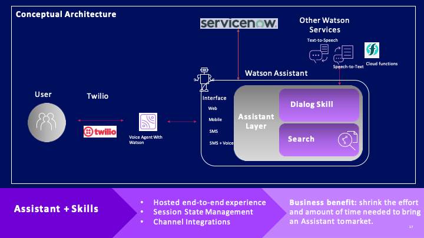

# Watson Assistant Integration With ServiceNow

  

## Contents

1. [Short description](#short-description)
1. [Demo video](#demo-video)
1. [The architecture](#the-architecture)
1. [Getting started](#getting-started)
1. [Running the tests](#running-the-tests)
1. [Live demo](#live-demo)
1. [Built with](#built-with)
1. [Contributing](#contributing)
1. [Versioning](#versioning)
1. [Authors](#authors)
1. [License](#license)
1. [Acknowledgments](#acknowledgments)

## Short description

### What's the problem?

### How can technology help?

### Use Cases
Use Cases handled as a part of this asset. This can be extended to any use case as per customer needs.

## Demo video

### 4 minute video 

[

### [Detailed Presentation Video]()

## The Architecture

### Conceptual Architecture

### High Level Architecture

### [Watson Platform](design-docs/watson-platform.png)

### [Watson Assistant Design](/design-docs/wa-design.md)

### [Watson Discovery Design](/design-docs/wds-design.md)

### [ServiceNow Design](design-docs/servicenow-design.md)

### [Project Plan Link](/design-docs/images/Product%20Roadmap%20-%20Timeline_%20By%20Team.png) 

## Getting started
These instructions will help you setup the Watson Assistant on ServiceNow.

### High Level Steps

1. Create a free IBM Cloud Account
2. Setup IBM Services
   1. Watson Assistant 
   2. Watson Discovery  
3. Setup Service Now

#### [SETUP INSTRUCTIONS](setup/instructions.md)

## Running the tests

Once deployed, run the scripts. 
### [Demo Scripts Folder](/demo-scripts)

1. DemoScript-Covid-19-Finance-Web+Slack.docx

Live demo below can be used to test.

## Live demo

### [Live Application Screenshots](/design-docs/app-screens.md)

### [Detailed Presentation Video](https://ibm.box.com/s/jgp8lslqzqsj5rcrdfsm0qeohcf64vg2)

### ServiceNow
You can find a running system to test at https://generic-covid19-assistant.mybluemix.net/
Click on  to invoke the virtual assistant.

Run the scripts **/demo-scripts/DemoScript-Covid-19-Finance-Web+Slack.docx**

## Built with

### IBM Cloud Services
* [IBM Watson Assitant](https://cloud.ibm.com/catalog/services/watson-assistant) - Watson Assistant lets you build conversational interfaces into any application, device, or channel.
* [IBM Watson Discovery](https://cloud.ibm.com/catalog/services/discovery) - Watson Discovery adds a cognitive search and content analytics engine to applications.
* [ServiceNow](https://cloud.ibm.com/catalog/services/voice-agent-with-watson) - IBM® Voice Agent with Watson™ helps you integrate a set of orchestrated Watson services with the telephone network by using the Session Initiation Protocol (SIP).

## Contributing

Please read [CONTRIBUTING.md](CONTRIBUTING.md) for details on our code of conduct, and the process for submitting pull requests to us.

## Versioning

We use [SemVer](http://semver.org/) for versioning.

## Authors

* **Arun Wagle** - *Project Lead* - (https://w3.ibm.com/bluepages/profile.html?uid=1J2509897)

## License

This project is licensed under the Apache 2 License - see the [LICENSE](LICENSE) file for details

## Acknowledgments

* TODO
