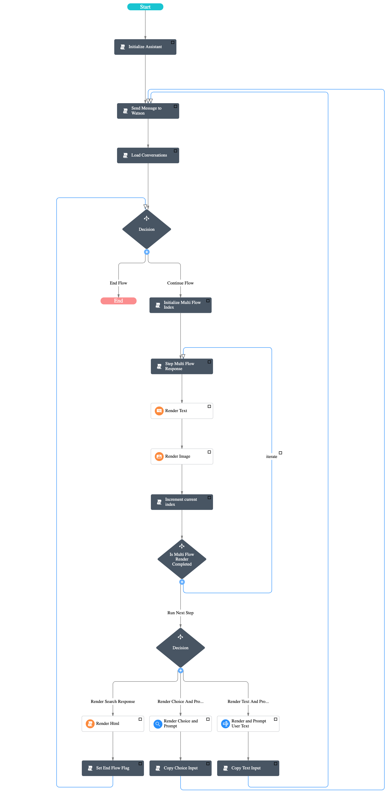

# ServiceNow & Watson Assistant Integration

## High Level Steps

1. [Create a ServiceNow developer account](#servicenow-developer-account)
2. [Configure the IBM Watson Assistant Chat integration](#configure-the-ibm-watson-assistant-chat-integration)
3. [Virtual Agent Designer Flow Design](#virtual-agent-designer-flow-design)
   1. Create Topic(#create-topic)
   2. [Node Source](#node-design)
   3. Save the flow(#save-the-flow)
   4. Preview(#preview)
   5. Publish(#publish)


## Create a ServiceNow developer account
**Watson Assistant version2 is currenlty supported in _Orlando workspace_ **

## Configure the IBM Watson Assistant Chat integration
Refer to https://docs.servicenow.com/bundle/orlando-performance-analytics-and-reporting/page/administer/virtual-agent/task/configure-watson-assistant-topic.html

Step 1
````
In your ServiceNow instance, activate these plugins: 
a. Search Plugins in the filter search box
b. Activate Glide Virtual Agent (com.glide.cs.chatbot), if not already activated (requires a subscription)
c. Activate IBM Watson Assistant Integration V2 plugin (com.glide.cs.ibm.watson.assistant.topicV2)

````
Step 2
````
In your ServiceNow instance, update the watson_assistant.workspaceID system property.
a. In the Navigation filter, enter sys_properties.list
b. In the System Properties [sys_properties] table, edit
   - watson_assistant.v2.assistantID - Replace the existing Value with the assistant ID for your skill, and click Update.
   - watson_assistant.v2.service_endpoint, edit value to gateway.watsonplatform.net
````

Step 3
````
a. Navigate to System Web Services > Outbound > REST Message.
b. Select the IBM Watson Assistant record to open the REST Message IBM Watson Assistance form.
c. Confirm that the Endpoint field and the Endpoint column displayed in the Authentication tab have the correct endpoint URL for your IBM Watson account. (Endpoint: gateway.watsonplatform.net)
4. Set Authentication type: Basic
5. Edit Basic auth profile: IBM Watson Assistant Profile (Click on info icon and edit the apikey and password) 
````

## Virtual Agent Designer Flow Design


## Create Topic
````
1. Select Virtual Agent > Designer from the Filter Navigation menu
2. Click on "Add a Topic" or select an existing topic "IBM Watson Assistant V2" and duplicate it.
3. Now you can design the flows by selecting the topic and clicking on the "Edit Topic Flow"
````

## Node Design

### Node - Initialize Assistant (Type: Script Action Basic Info)
Action Expression
````
(function execute() {
    vaVars.assistant_id = gs.getProperty('watson_assistant.v2.assistantID');
    var assistant = new global.IBMWatsonAssistantV2(vaVars.assistant_id);
    vaVars.session_id = assistant.createSession();
})()
```` 

### Node - Send Message to Watson (Type: Script Action Basic Info)
Action Expression
````
(function execute() {
    vaVars.assistant_id = gs.getProperty('watson_assistant.v2.assistantID');
    var assistant = new global.IBMWatsonAssistantV2(vaVars.assistant_id);
    vaVars.session_id = assistant.createSession();
})()
```` 
Condition (Script)
````
(function execute() {    
    return true;
})()
```` 

### Node - Load Conversations (Type: Script Action Basic Info)
Action Expression
````
(function execute() {
    gs.info("START:: Load Conversations"); 
    var watsonResponseObj = JSON.parse(vaVars.watsonResponse)
    vaVars.endFlow = true;
    if (watsonResponseObj.output.generic.length > 0){
        vaVars.endFlow = false;
        recordCount = watsonResponseObj.output.generic.length;
        
        var textUserInputResponse ;
        var choiceUserInputResponse;
        var multiFlowResponse = [];
        var searchFlowResponse;
        var connectToAgentInputResponse = false;

        var finalResponse = [];

        var textRecords =  watsonResponseObj.output.generic.filter(function(record) {            
	        return record.response_type === 'text';
        });
        var choiceRecords =  watsonResponseObj.output.generic.filter(function(record) {
	        return record.response_type === 'option';
        });

        gs.info("Load Conversations::textRecords::" + JSON.stringify(textRecords));
        gs.info("Load Conversations::watsonResponseObj::length::" + watsonResponseObj.output.generic.length);

        for (i = 0; i < watsonResponseObj.output.generic.length; i++) {
           var response_type = watsonResponseObj.output.generic[i].response_type;
           gs.info("Load Conversations::response_type::" + response_type);
           
           if (response_type === 'option'){                         
              choiceUserInputResponse = watsonResponseObj.output.generic[i];            
           }                  
           else if (response_type === 'text'){
               textVal = watsonResponseObj.output.generic[i].text;
               gs.info("+++++++Load Conversations::index::" + textVal.indexOf("search")); 
               if(textVal.indexOf("search") !== -1){
                   searchFlowResponse = watsonResponseObj.output.generic[i];
               }
               else if(recordCount == 1){ 
                  var textVal = watsonResponseObj.output.generic[i].text;                     
                  textUserInputResponse = watsonResponseObj.output.generic[i];                  
               }
               else{
                   currentText = watsonResponseObj.output.generic[i];
                   lastText = textRecords[textRecords.length -1];
                   if(choiceRecords.length == 0 && currentText === lastText){
                       textUserInputResponse = watsonResponseObj.output.generic[i];
                   }
                   else{
                       multiFlowResponse.push(watsonResponseObj.output.generic[i]);
                   }   
               }
           }
        //    currently image handling is done only for multiflow response
           else if (response_type === 'image'){
               multiFlowResponse.push(watsonResponseObj.output.generic[i]);
           }
           else if (recordCount == 1 && response_type === 'connect_to_agent'){               
              connectToAgentInputResponse = true;
           }
                  
        }
        
        vaVars.multiFlowResponseJSON = JSON.stringify(multiFlowResponse); 
        vaVars.searchFlowResponseJSON = JSON.stringify(searchFlowResponse); 
        vaVars.choiceUserInputResponse = JSON.stringify(choiceUserInputResponse); 
        vaVars.textUserInputResponse = JSON.stringify(textUserInputResponse); 
        vaVars.connectToAgentInputResponse = connectToAgentInputResponse;
        gs.info("END::Load Conversations: multiFlowResponse :: " + vaVars.multiFlowResponseJSON
               + " choiceUserInputResponse:: " + vaVars.choiceUserInputResponse
               + " textUserInputResponse:: " + vaVars.textUserInputResponse
               + " searchFlowResponse::" + vaVars.searchFlowResponseJSON
               + " connectToAgentInputResponse:: " + vaVars.connectToAgentInputResponse); 

        return true;
    }
    return false;
})()


```` 

### Node Edge - Continue Flow
Condition (Script)
````
(function execute() {
    return vaVars.connectToAgentInputResponse === true ? false : true;      
})()

```` 
### Node Edge - End Flow
Condition (Script)
````
(function execute() {
    return (vaVars.endFlow === true || 
            vaVars.connectToAgentInputResponse === true) ? true : false;      
})()

```` 

### Node - Initialize Multi Flow Index (Type: Script Action Basic Info)
Action Expression
````
(function execute() {
    vaVars.currentIndex = 0;     
})()

````
### Node - Step Multi Flow Response (Type: Script Action Basic Info)
Action Expression
````
(function execute() {
    var i = vaVars.currentIndex; 
    gs.info("START :: Step Multi Flow Response: response ::currentIndex ::" + i ); 
    var multiFlowResponseArr = JSON.parse(vaVars.multiFlowResponseJSON); 
    var multiFlowResponseObj = multiFlowResponseArr[i];
      
    if (multiFlowResponseObj.response_type === 'text'){
        vaVars.multiFlowTextResponse = true;        
    } 
    else if (multiFlowResponseObj.response_type === 'image'){
        vaVars.multiFlowImageResponse = true;            
    }    
           
    vaVars.currentMultiFlowResponseJSON = JSON.stringify(multiFlowResponseObj);
    gs.info("END :: Step  Multi Flow Response:: currentMultiFlowResponseJSON::" +  vaVars.currentMultiFlowResponseJSON);
})()

```` 
Condition (Script)
````
(function execute() {
    var multiFlowResponse = JSON.parse(vaVars.multiFlowResponseJSON);     
    var runMultiFlow = multiFlowResponse.length > 0 ? true : false;
    gs.info("CONDITION::Step Multi Flow Response:: runMultiFlow:: " + runMultiFlow);
    return runMultiFlow;
})()

```` 
### Node - Render Text (Type: Text Output Basic Info)
Action Expression
````
(function execute() {
   var currentMultiFlowResponse = JSON.parse(vaVars.currentMultiFlowResponseJSON)
   vaVars.multiFlowTextResponse = false;      
   return currentMultiFlowResponse.text;  
    
})()


```` 
Condition (Script)
````
(function execute() {

    var isMultiFlowTextResponse = vaVars.multiFlowTextResponse == true ? true : false;
    gs.info("CONDITION::Render Text:: isMultiFlowTextResponse:: " + isMultiFlowTextResponse);
    return isMultiFlowTextResponse;
})()
```` 

### Node - Render Image (Type: Image Basic Info)
Action Expression
````
(function execute() {
   var currentMultiFlowResponse = JSON.parse(vaVars.currentMultiFlowResponseJSON)
   gs.info("Render Image ::currentMultiFlowResponse:: " + currentMultiFlowResponse ); 
   vaVars.multiFlowImageResponse = false;    
   return currentMultiFlowResponse.source;  
    
})()

```` 
Condition (Script)
````
(function execute() { 
    var isMultiFlowImageResponse = vaVars.multiFlowImageResponse == true ? true : false;
    gs.info("CONDITION:: Render Image :: isMultiFlowImageResponse:: " + isMultiFlowImageResponse);
    return isMultiFlowImageResponse;
})()
```` 

### Node - Increment current index (Type: Script Action Basic Info)
Action Expression
````
(function execute() {
    gs.info("START:: Increment current index ");
    vaVars.currentIndex++;  
})()

```` 
Condition (Script)
````
(function execute() {
    var multiFlowResponse = JSON.parse(vaVars.multiFlowResponseJSON);     
    incrementCurrentIndex = multiFlowResponse.length > 0 ? true : false;
    gs.info("CONDITION:: Increment current index:: incrementCurrentIndex :: " + incrementCurrentIndex);
    return incrementCurrentIndex;
})()

```` 

### Node Edge - Iterate
Condition (Script)
````
(function execute() {
    var multiFlowResponse = JSON.parse(vaVars.multiFlowResponseJSON); 
    var currentIndex = vaVars.currentIndex;    
    isIterate = currentIndex <= multiFlowResponse.length - 1 ? true : false;
    gs.info("CONDITION:: iterate:: isIterate:: " + isIterate);

    return isIterate;
})()

```` 

### Node Edge - Run Next Step
Condition (Script)
````
(function execute() {
    var multiFlowResponse = JSON.parse(vaVars.multiFlowResponseJSON); 
    var currentIndex = vaVars.currentIndex;    
    runNextStep = (currentIndex == multiFlowResponse.length) ? true : false;
    
    gs.info("CONDITION:: Run Next Step:: runNextStep :: " + runNextStep);
    return runNextStep;
})()

```` 

### Node Edge - Render Search Response
Condition (Script)
````
(function execute() {
    gs.info("START:: Render Search Response ");     
    var searchResponse = JSON.parse(vaVars.searchFlowResponseJSON);       
    var renderSearchResponse = searchResponse != null ? true: false;
    gs.info("END:: Render Search Response:: renderSearchResponse:: " + renderSearchResponse);
    return renderSearchResponse;   
})()

```` 

### Node Edge - Render Choice And Prompt Decision
Condition (Script)
````
(function execute() {
    gs.info("START:: Render Choice And Prompt Decision ");     
    var choiceResponse = JSON.parse(vaVars.choiceUserInputResponse);   

    var searchResponse = JSON.parse(vaVars.searchFlowResponseJSON);       
    var renderSearchResponse = searchResponse != null ? true: false;

    var renderChoiceResponse = (choiceResponse != null && renderSearchResponse == false) 
                                ? true: false;

    gs.info("END:: Render Choice And Prompt Decision:: renderChoiceResponse:: " + renderChoiceResponse);
    return renderChoiceResponse;   
})()

```` 

### Node Edge - Render Text And Prompt Decision
Condition (Script)
````
(function execute() {
    gs.info("START:: Render Text And Prompt Decision ");     
    var textResponse = JSON.parse(vaVars.textUserInputResponse); 
    var searchResponse = JSON.parse(vaVars.searchFlowResponseJSON);       
    var renderSearchResponse = searchResponse != null ? true: false;

    var renderTextResponse = (textResponse != null && renderSearchResponse == false) 
                                ? true: false;          
    
    gs.info("END:: Render Text And Prompt Decision:: renderTextResponse:: " + renderTextResponse);
    return renderTextResponse;   
})()


```` 

### Node - Render Html (Type: Script Basic Info, Script Output Type- Multipart)
Script Response Message
````
(function execute() {
      /*************************************************************** 
       YOU CAN OUTPUT A SinglePartOutMsg (see full API for sn_cs.SinglePartOutMsg), 
       LIKE THIS:
       
       var singleOutMsg = new sn_cs.SinglePartOutMsg();
       singleOutMsg.setTextPart('text part');
       return singleOutMsg;
      ****************************************************************/ 
          
      /*************************************************************** 
       OR YOU CAN OUTPUT A MultiPartOutMsg (see full API for sn_cs.MultiPartOutMsg),
       LIKE THIS:
       
       var multiOutMsg = new sn_cs.MultiPartOutMsg();
       multiOutMsg.setNavigationLabel('Click for More');
       multiOutMsg.addPlainTextPart('text part 1');
       multiOutMsg.addPlainTextPart('text part 2');
       return multiOutMsg;
      ****************************************************************/
      
      /***************************************************************
       * NOTE: You can include conditional logic when building the 
       * output content. For example, if constructing a sn_cs.MultiPartOutMsg 
       * then you might want to add 3 parts under condition (A) but 7 parts 
       * under condition (B).
       *
       * HOWEVER, do NOT include conditional logic that varies the output TYPE.
       * That is, do NOT include a condition that might return either a
       * sn_cs.SinglePartOutMsg under condition (A) but returns a 
       * sn_cs.MultiPartOutMsg under condition (B).
       ****************************************************************/

      gs.info("START::Render HTML:: ");  
      var searchResponseText = JSON.parse(vaVars.searchFlowResponseJSON).text;
      var searchResponse = JSON.parse(searchResponseText);
      gs.info("Render HTML:: searchResponse:: " + searchResponse);        
      var header = "I searched my knowledge base and found this information which might be useful";    
      var htmlString = '<h2 style="color: #4485b8;">' + header + '</h2>';
      title = searchResponse.title;
      gs.info("Render HTML:: title:: " + title);
      answer = searchResponse.text;                    
      htmlString += '<h3>' + title + '</h3>';
      htmlString += '<p>' + answer + '</p>';   
    
      var multiOutMsg = new sn_cs.MultiPartOutMsg();  
      multiOutMsg.addHtmlPart(htmlString);
      // var singlePartOutMsg = new sn_cs.SinglePartOutMsg();   
      // singlePartOutMsg.addHtmlPart(htmlString);
      gs.info("END::Render HTML:: htmlString:: " + htmlString);
            
      return multiOutMsg;
})()

```` 
### Node - Render Choice and Prompt (Type: Reference Choice List Basic Info)
Prompt
````
(function execute() {
   responseObj = JSON.parse(vaVars.choiceUserInputResponse);
   var message = responseObj.title 
   return message;
})()

```` 
Reference Type (Script) , Choice Value Expression
````
(function execute() {
    var options = [];
    responseObj = JSON.parse(vaVars.choiceUserInputResponse);
    var suggestions = responseObj.options;
    suggestions.forEach(function(option){
        options.push({'value': option.value.input.text,
                      'label':option.label})
    })  
    gs.info("suggestion:: Options ::" + options);        
    return options;    
})()

```` 
### Node - Render and Prompt User Text (Type: String Basic Info)
Prompt
````
(function execute() {
   responseObj = JSON.parse(vaVars.textUserInputResponse);
   var message = responseObj.text 
   return message;
})()

````

### Node - Set End Flow Flag (Type: Script Action Basic Info)
Action Expression
````
(function execute() {
    
    gs.info("START::Set End Flow Flag");
    //  clear search field
    vaVars.searchFlowResponseJSON = null;

    var textResponse = JSON.parse(vaVars.textUserInputResponse); 
    if (textResponse != null) {
        vaVars.endFlow = false;
    }
    else{
        vaVars.endFlow = true;
    }
    
})()

```` 

### Node - Copy Choice Input (Type: Script Action Basic Info)
Action Expression
````
(function execute() { 
    gs.info("START::Copy Choice Input" );         
    vaVars.user_response = vaInputs.render_choice_and_prompt.getValue();       
})()

```` 

### Node - Copy Text Input (Type: Script Action Basic Info)
Action Expression
````
(function execute() { 
    gs.info("START::Copy Text Input" );         
    vaVars.user_response = vaInputs.render_and_prompt_user_text.getValue();        
})()

```` 

## Save the flow
## Preview
## Publish

````
1. Make sure you save the flow by clicking on save button
2. Preview lets you test the flow. Refer to the demo-scripts folder to run all the test scripts 
3. Publish - Deploy an inactive topic to make it available to users on Virtual Agent clients.
````


## Runtime Screenshot


